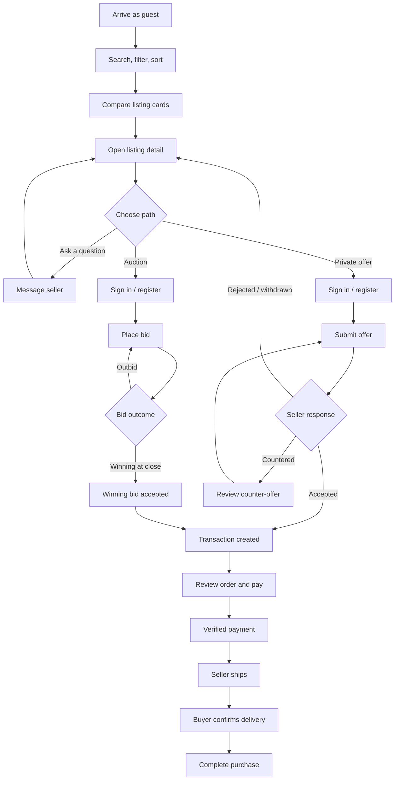
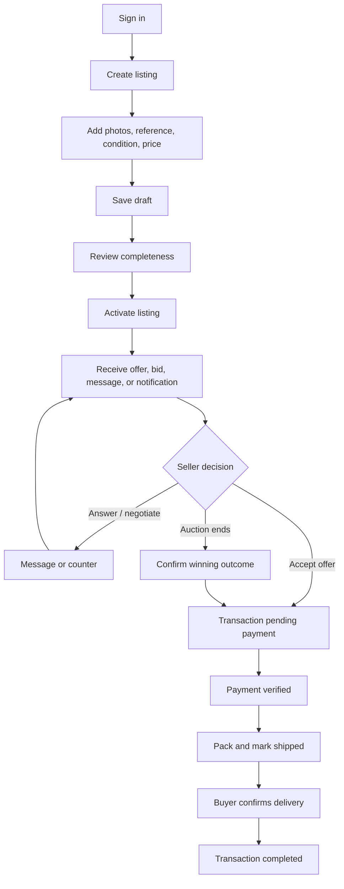
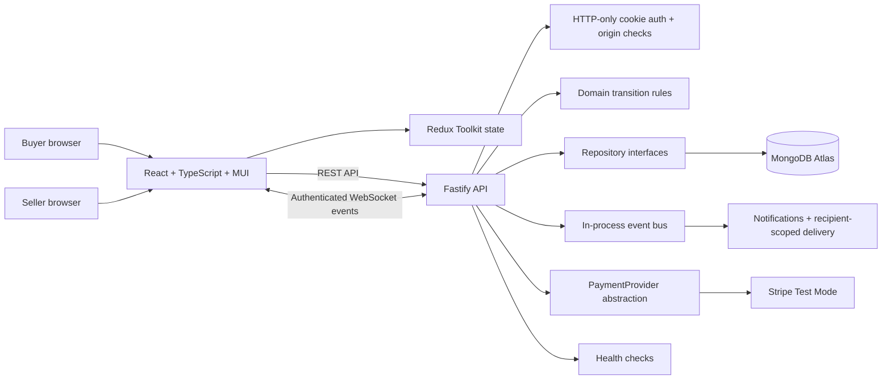
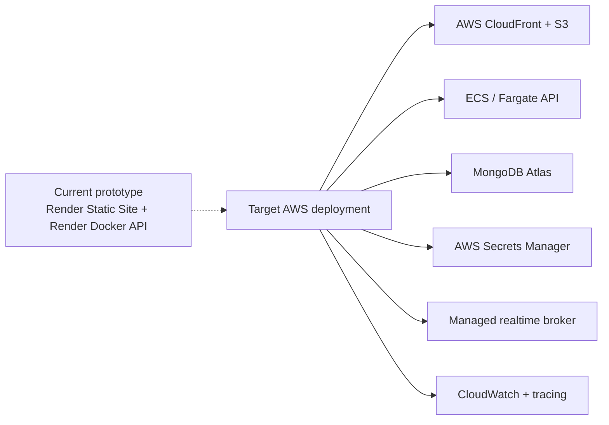
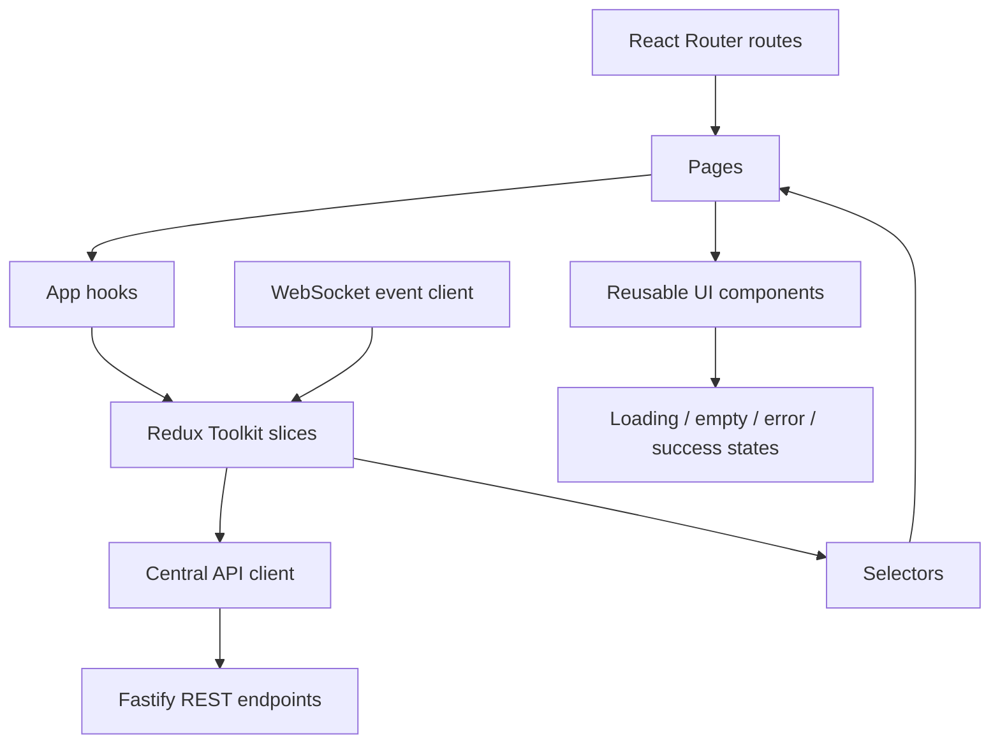
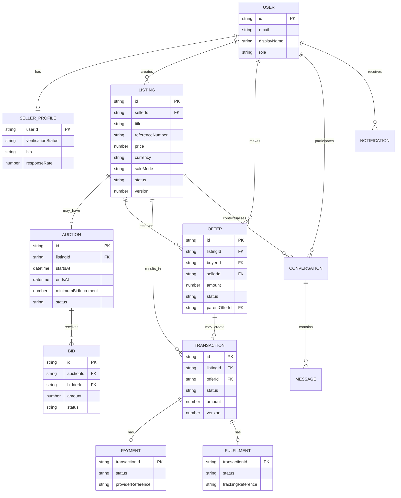
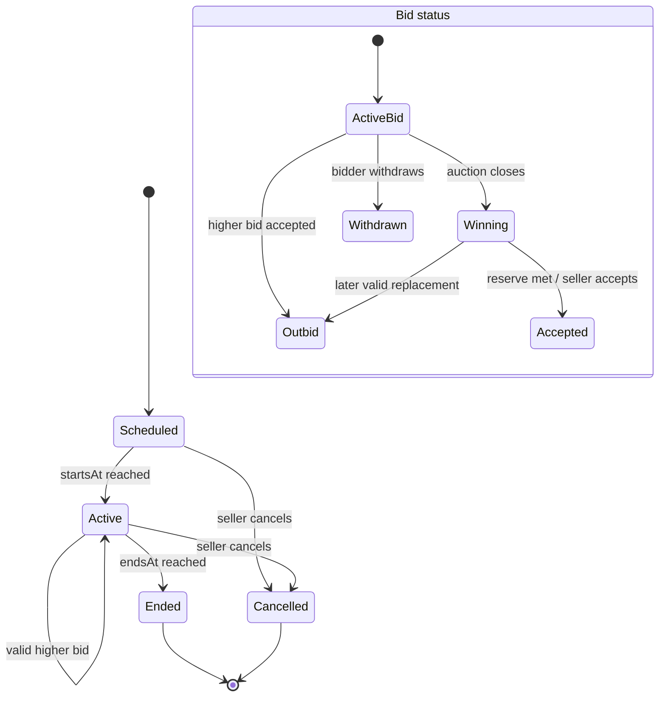
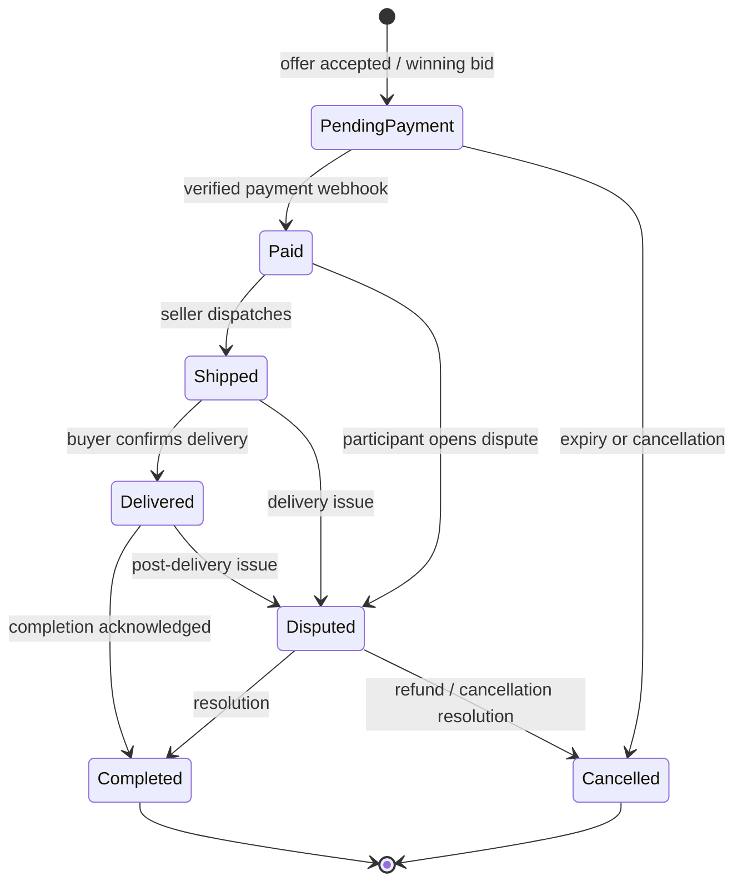

# Atlas Marketplace — Concept Presentation

> A considered marketplace for authenticated pre-owned luxury watches, connecting buyers and trusted sellers through discovery, valuation, negotiation, and protected purchase.

**Prepared:** 2 October 2026  
**Product:** Atlas Marketplace  
**Scope:** Concept, journeys, architecture, visual concept, and delivery disclosure

---

## 1. The brief

### The opportunity

Buying a pre-owned luxury watch is high-consideration commerce. A buyer is not only choosing a reference and a price; they are deciding whether to trust the listing, the seller, the condition description, and the transaction process.

Atlas makes that decision easier by bringing the full journey into one calm, evidence-led marketplace:

1. **Find confidently** — curated listings, useful filters, detailed imagery, and seller context.
2. **Reach a fair price** — fixed-price purchase, private offers, counter-offers, and auctions.
3. **Complete safely** — payment, shipping, delivery confirmation, notifications, and dispute support.

### Product thesis

> **The best luxury-watch marketplace feels less like a classified site and more like a knowledgeable, trustworthy advisor.**

### Success measures for a first release

| Outcome                       | Signal                                                                                   |
| ----------------------------- | ---------------------------------------------------------------------------------------- |
| Buyer confidence              | Listing-detail engagement, seller-profile views, saved/shared listings, offer conversion |
| Healthy marketplace liquidity | Active listings, time to first offer/bid, completed transactions                         |
| Seller quality                | Listing completeness, response rate, verified-seller adoption                            |
| Safe fulfilment               | Payment success, shipment-to-delivery completion, dispute rate                           |
| Operational clarity           | Fewer support contacts caused by unclear status or missing notifications                 |

### Design principles

- **Evidence before urgency:** show condition, provenance fields, seller context, and status clearly.
- **Quiet luxury:** restrained typography, generous spacing, editorial imagery, and no noisy promotional treatment.
- **Progressive commitment:** let buyers explore as guests; require authentication only for actions that create risk or commitment.
- **One obvious next step:** every state has a clear primary action and an honest status.
- **Server-authoritative money movement:** payment and lifecycle changes are verified on the server, not trusted from the browser.
- **Accessible by default:** keyboard navigation, meaningful labels, contrast, responsive layouts, and explicit loading/error/empty states.

---

## 2. The three marketplace areas

### Area 1 — Discovery and trust

**Buyer need:** “Help me understand what this is and whether I can trust it.”

- Search by brand, model, reference, or description.
- Filter by category and price; sort by recency or price.
- Listing cards with image, title, price, condition, location, and sale mode.
- Detail page with gallery, reference details, condition, description, seller profile, and response context.
- Verified seller status, member-since date, location, response rate, and active/sold listing count.
- Guest browsing with sign-in at offer, bid, message, or purchase intent.

**Value:** reduces uncertainty before a buyer spends time negotiating or money purchasing.

### Area 2 — Offers, negotiation, and auctions

**Buyer need:** “Let me make a fair proposal in the way that suits this listing.”

- Fixed-price listings communicate the asking price and purchase intent.
- Private offers allow a buyer to name a price.
- Sellers can accept, reject, or counter; buyers can respond or withdraw.
- Auction listings show start/end time, current bid, minimum increment, reserve context, and bid history status.
- Competing bids use conditional server updates so a lower/stale bid cannot overwrite a higher one.
- Recipient-scoped real-time events update offers, bids, notifications, and messages without exposing another user’s private activity.

**Value:** supports both discreet negotiation and transparent price discovery without splitting the experience across products.

### Area 3 — Protected transaction and fulfilment

**Buyer need:** “Make the purchase safely and know what happens next.”

- Accepted offers create a transaction in `pending_payment`.
- Stripe Test Mode is isolated behind a server-side payment-provider interface.
- Verified payment webhook moves the payment/transaction forward; the browser cannot mark an order paid.
- Seller marks shipment; buyer confirms delivery; both parties see an explicit timeline.
- Completion, cancellation, and dispute states are visible and auditable.
- Notifications and messages keep the buyer and seller aligned at each hand-off.

**Value:** converts a successful negotiation into a transparent, lower-anxiety purchase.

---

## 3. Primary user journeys

### Buyer journey — discovery to completed purchase

**Key moments to design:** confidence at the detail page, clarity after an offer/bid, payment reassurance, and fulfilment visibility.

### Seller journey — listing to completed sale

### Journey guardrails

| Moment          | Buyer sees                                      | Seller sees                               | System guarantee                         |
| --------------- | ----------------------------------------------- | ----------------------------------------- | ---------------------------------------- |
| Offer submitted | Pending response and notification preference    | New offer with amount and listing context | Versioned offer transition               |
| Counter-offer   | Counter amount, expiry/status, response actions | Waiting for buyer response                | Valid `pending ↔ countered` path only    |
| Auction close   | Winning/outbid outcome                          | Winning bid and next action               | Atomic minimum-bid check and close state |
| Payment         | Amount, currency, payment status                | Payment received only after verification  | Stripe webhook is authoritative          |
| Fulfilment      | Shipment and delivery status                    | Ship action and delivery confirmation     | Explicit fulfilment transitions          |

---

## 4. System architecture

### Technical approach

| Layer                 | Choice                                                 | Rationale                                                                                         |
| --------------------- | ------------------------------------------------------ | ------------------------------------------------------------------------------------------------- |
| Web                   | React, TypeScript, Vite, Material UI                   | Fast iteration with typed, responsive, accessible UI primitives                                   |
| Client state          | Redux Toolkit                                          | Explicit, testable workflow state for listings, offers, messages, notifications, and transactions |
| API                   | Fastify + TypeScript                                   | Small, performant HTTP boundary with schema-friendly route organization                           |
| Domain                | Typed transition guards                                | Prevents invalid listing, auction, bid, offer, payment, and fulfilment changes                    |
| Persistence           | Repository interfaces + MongoDB Atlas                  | Keeps application logic testable and persistence replaceable                                      |
| Payments              | Stripe behind `PaymentProvider`                        | Isolates provider details and makes webhook reconciliation explicit                               |
| Realtime              | Authenticated WebSocket + REST reconciliation          | Immediate feedback while REST remains authoritative after reconnect                               |
| Deployment            | Render static site + Docker API                        | Reproducible interview deployment with a small operational footprint                              |
| Quality               | Vitest, Playwright, ESLint, TypeScript, GitHub Actions | Covers domain rules, API/UI behavior, real journeys, and release gates                            |
| Code quality (target) | SonarQube or SonarCloud in CI                          | Planned static-analysis and quality-gate layer; not enabled in the current prototype              |

### Important reliability decisions

- **Optimistic UI is bounded:** the client may show intent immediately, but server responses and events reconcile the final state.
- **Concurrency is explicit:** offer, transaction, payment, auction, and bid versions protect against stale updates.
- **No cross-user leakage:** WebSocket events are authenticated and recipient-scoped.
- **Provider boundaries are replaceable:** Stripe Test Mode can be replaced without changing marketplace domain logic.
- **Prototype limitation:** the current interview deployment uses an in-process event bus and documents that a production multi-instance deployment needs a shared broker and CSRF protection for cookie-authenticated mutations.

### Current deployment versus target production architecture

The submitted prototype runs on **Render** because it was the smallest reproducible deployment option for the interview: a Render Static Site hosts the frontend and a Render Docker service hosts the API. **AWS is the target production direction, not an implemented part of this prototype.** The AWS design below is intentionally recorded as an evolution path so the architecture remains credible without overstating what was delivered.

#### AWS migration mapping

| Current prototype            | Target AWS / production equivalent              | Why                                                    |
| ---------------------------- | ----------------------------------------------- | ------------------------------------------------------ |
| Render Static Site           | S3 + CloudFront                                 | Durable static hosting, CDN delivery, and edge caching |
| Render Docker API            | ECS/Fargate behind an application load balancer | Horizontally scalable container runtime                |
| In-process event bus         | Managed broker or pub/sub layer                 | Cross-instance realtime delivery and event fan-out     |
| Environment configuration    | AWS Secrets Manager + IAM                       | Centralized secret storage and least-privilege access  |
| Render health check and logs | CloudWatch metrics/logs, alarms, and tracing    | Operational visibility and incident response           |

### Sonar quality-gate plan

SonarQube/SonarCloud is included as a **planned CI quality gate**, not as a claim about the current implementation. The intended pipeline is:

1. GitHub Actions runs linting, type checking, unit tests, coverage, build, and Playwright.
2. Sonar analyses TypeScript source and test coverage reports.
3. The pull request is blocked when the configured quality gate fails, for example on new bugs, vulnerabilities, code smells, duplicated code, or insufficient new-code coverage.
4. A maintainer reviews or explicitly accepts any justified exception.

The current repository already has ESLint, TypeScript, Vitest coverage, Playwright, and GitHub Actions checks. Sonar would consolidate trend reporting and introduce an additional static-analysis gate when production CI credentials and project configuration are available.

---

## 5. Frontend architecture

### Principal frontend modules

- **Listings:** marketplace query state, listing cards, detail gallery, listing form, seller card.
- **Offers and auctions:** offer panel, bid state, counters, acceptance and withdrawal actions.
- **Transactions:** payment preparation, status timeline, shipment and delivery actions.
- **Messaging:** conversations, messages, read state, seller questions.
- **Realtime and notifications:** event ingestion, deduplication, toast/inbox notifications, reconnect reconciliation.
- **Shared UX:** price formatting, status chips, loading skeletons, error recovery, responsive navigation.

---

## 6. Data model

---

## 7. Bidding and purchase lifecycle

### Auction and bid state diagram

### Purchase state diagram

**State ownership:** domain rules live on the API; the UI renders states and available actions from server responses. Every state transition emits a typed marketplace event and creates a notification where appropriate.

---

## 8. Visual concept

The visual direction is **quiet, editorial, and evidence-led**: warm neutral surfaces, charcoal text, one restrained accent, generous whitespace, and large product imagery. The following wireframes are intentionally low-fidelity so the interaction model can be reviewed before visual polish.

### Screen A — Marketplace discovery

### Screen B — Listing detail and offer panel

### Screen C — Transaction timeline

### Responsive and accessibility notes

- On mobile, discovery filters become a single “Refine” control and listing cards become one column.
- The detail page keeps the primary action visible after the gallery and uses a stacked offer panel.
- Status is communicated with text and iconography, never colour alone.
- Focus order follows the reading order; galleries and dialogs support keyboard escape and labels.
- Empty, loading, failed-image, API-error, and not-found states are designed rather than left blank.

---

## 9. Delivery plan

### Phase 1 — Trustworthy browsing

Responsive discovery, listing details, seller profiles, authentication, listing creation, image handling, loading/error/empty states.

### Phase 2 — Market interaction

Offers, counters, withdrawals, auction creation, bids, outbid notifications, messaging, and recipient-scoped realtime updates.

### Phase 3 — Protected completion

Transactions, Stripe payment intent and webhook reconciliation, fulfilment timeline, shipment/delivery confirmation, disputes, and operational notifications.

### Phase 4 — Production hardening

AWS migration from the current Render deployment, shared realtime broker for multiple API instances, Sonar quality gates, CSRF protection or same-origin mutation policy, observability, moderation, seller verification workflow, and stronger audit tooling.

---

## 10. AI and tools disclosure

| Tool                                                        | Used for                                                                                                                  | Human decisions and changes                                                                                                                                                 |
| ----------------------------------------------------------- | ------------------------------------------------------------------------------------------------------------------------- | --------------------------------------------------------------------------------------------------------------------------------------------------------------------------- |
| GitHub Copilot, accessed through the Copilot SDK in VS Code | Repository exploration, synthesis of existing domain rules, document drafting, diagram scaffolding, and quality checklist | Defined the product thesis, selected the three marketplace areas, chose the journeys and states, edited all claims, and kept the proposal aligned with the implemented code |
| Existing TypeScript source and tests                        | Evidence for architecture, statuses, API boundaries, payment behavior, auction concurrency, and user journeys             | Cross-checked the proposal against the actual modules and documented the prototype’s known production limitations                                                           |
| Mermaid diagrams                                            | System, frontend, data, journey, and lifecycle diagrams                                                                   | Reviewed diagram readability and simplified labels so they can be pasted into Notion code blocks or rendered by Mermaid-compatible tools                                    |
| Markdown wireframes                                         | Fast visual concept communication without introducing a design dependency                                                 | Chose the information hierarchy, primary actions, responsive behavior, and accessibility notes                                                                              |
| SonarQube/SonarCloud (planned)                              | Defined the intended static-analysis and quality-gate role in the future CI pipeline                                      | Did not present Sonar as implemented; retained the existing ESLint, TypeScript, coverage, and test checks as the evidence for the prototype                                 |
| AWS architecture references (planned)                       | Mapped the Render prototype to a future S3/CloudFront, ECS/Fargate, Secrets Manager, broker, and CloudWatch setup         | Chose Render for the interview because of time, cost, and deployment simplicity; documented AWS as the target rather than claiming it was used                              |

### Quality and accuracy checks

- Confirmed the stack and deployment model against the repository README.
- Confirmed auction, bid, offer, listing, payment, fulfilment, and transaction statuses against the typed domain code.
- Confirmed the data entities and interaction surfaces against the shared types and web pages.
- Kept payment language server-authoritative: the browser does not independently mark a transaction paid.
- Called out known prototype limitations instead of presenting them as solved production capabilities.
- Clearly separated implemented tools (Render, GitHub Actions, ESLint, TypeScript, Vitest, and Playwright) from planned tools (AWS and SonarQube/SonarCloud).
- Used only links and files in this repository plus public vendor links; no credentials or private third-party data were used.

---

## 11. Supporting links

### Live project links

- [GitHub repository](https://github.com/sagar-vaghela/greenstone-atlas-marketplace) — source code, documentation, tests, and deployment configuration.
- [Live web application](https://greenstone-atlas-marketplace.onrender.com) — deployed Atlas Marketplace frontend.
- [Live API](https://greenstone-atlas-marketplace-api.onrender.com) — deployed marketplace API base URL; the health endpoint is `/health`.
- [GitHub Actions CI/CD](https://github.com/sagar-vaghela/greenstone-atlas-marketplace/actions) — workflow runs, quality checks, builds, and deployment-related automation.
- [Render](https://render.com/) — hosting platform used for the current frontend and API deployment.

The live web application was reachable during the final link check. The API deployment returned HTTP 503 during the check, which is recorded transparently rather than presented as a successful API health check; this may indicate a sleeping service, a deployment issue, or an unavailable dependency. The GitHub links are included as supplied project links and may require repository access depending on their visibility.

### Repository and research links

All repository links below are relative references that can be pasted into a Notion page or opened from the project.

- [Project README](../README.md) — implementation overview, deployment model, security limitation, and demo runbook.
- [Web application](../apps/web/src) — React pages, components, state, and visual styles.
- [API application](../apps/api/src) — Fastify routes, domain rules, repositories, payments, and events.
- [Shared types](../packages/types/src/index.ts) — marketplace entities, statuses, and event payloads.
- [Domain tests](../tests/domain.test.ts) — transition and state-rule coverage.
- [Marketplace journey tests](../tests/e2e/marketplace.spec.ts) — end-to-end discovery and purchase-oriented behavior.
- [Offer journey tests](../tests/e2e/offers.spec.ts) — negotiation flow coverage.
- [Auction journey tests](../tests/e2e/auctions.spec.ts) — bidding and auction lifecycle coverage.
- [Stripe](https://stripe.com/docs) — public payment-provider reference.
- [Mermaid](https://mermaid.js.org/) — public diagram syntax reference.
- [AWS architecture](https://aws.amazon.com/architecture/) — public reference for the target deployment direction.
- [SonarQube](https://www.sonarsource.com/products/sonarqube/) — public reference for the planned quality-gate layer.

### Submission checklist

- [x] Concept presentation covering the brief and three marketplace areas
- [x] Buyer and seller journeys from discovery/listing to completed purchase
- [x] System architecture diagram
- [x] Frontend architecture diagram
- [x] Data model
- [x] Bidding and purchase lifecycle state diagrams
- [x] Key screen wireframes
- [x] AI and tools disclosure with quality checks
- [x] Supporting links listed as repository-relative, live deployment, or public reference links
